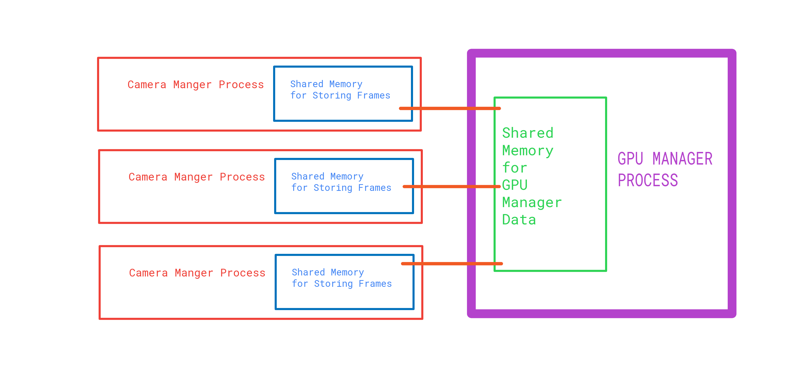

# IPC (Inter-process Communication)
A simple C linux IPC program which tries to implement Mock Queuing and Processing of incoming(never ending) camera data by GPU/software. :D


## Compiling and Running
Just run `make` in **linux** shell to compile.
or alternatively
```bash
gcc -g -lpthread -o main src/main.c src/gpu_manager.c src/camera_manager.c
```
### To Run
```bash
./main
```

## WARNINGS
This Program spawns multiple child processes so computer fans might start running or cpu might heat up.

## Process Management
Signals are used for notifying status of parent - child processes to each other.
`SIGCHLD` is handled in parent process, in case child process dies , so parent can handle situation accordingly.
<br>
`prctl(PR_SET_PDEATHSIG, SIGTERM)` is called inside child process, so that kernel notifies child process that parent process has died and child process can handle situation accordingly.

## Working

The main(gpu_manager_process) forks into multiple child(camera_manager_process) and stores information about them in shared memory created from mmap. (semaphores for process synchronization)

The camera_manager_process infinitely reads from /dev/urandom and stores frames(chunks of 1280x800 bytes) into it's shared memory.

The gpu_manager_process checks if some camera_manager has enough frames, ready to be encoded and then creates 1 or 2 threads for handling camera_manager_process (simulating 2 encode sessions of GPU).


